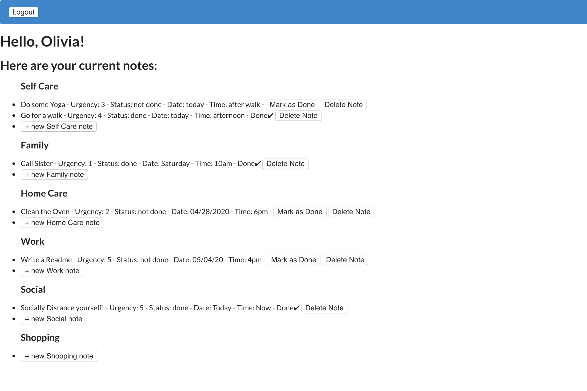

# README

## Flatnote

### Back-end Repo: https://github.com/maddeno/backend_flatnote

### Demo: https://drive.google.com/open?id=1rW8R_mAbXNXwHNujyfmeWIc8THs9y9vM

### Technologies: Ruby, Rails, Postgresql


Flatnote is a to-do list app with a React front-end and a Rails back-end. The front-end consists of several components: a homepage welcoms the user and prompts them to either log in or create an account. The navbar conditionally renders input field depending on which button the user selects.

When a user logs in they are taken to the TaskList component. This renders a table of the six different tasks as well as all of the pre-existing notes that fall under those tasks. From there users can create new notes, update existing notes to "done", and delete notes. 

To start run ```npm start```. Use the link at the top of the Readme to navigate to the back-end repo. In another terminal, start the rails server with ```rails s```.
 